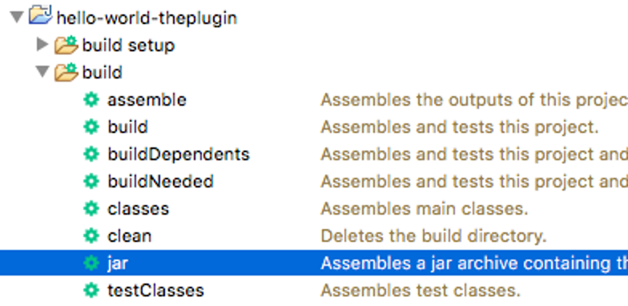

## 3.4 Hello World: The Plugin

The purpose of this plugin is to be applied by any other Gradle build, which will add the “hello” task to that build. When that task is run, it will print “Hello World!!!” at the command-line. This is accomplished by using Gradle to compile a Groovy-based library, which uses the Gradle API to define the custom plugin and its task. To manually test that the plugin works, an additional Gradle build that uses the plugin, by referencing the jar as its sits on the local file system, is included.

While there is not any specific functionality that can be tested, Spock tests for both the Plugin and Task classes are setup to demonstrate the basics. Spock is preferred for unit testing Gradle plugins, because Gradle plugins typically deal with the file system, command-line, other external entities, and Gradle itself, which can be difficult to mock.

#### build.gradle

```groovy
apply plugin: 'groovy'

version = '1.0.0'
group = 'com.blogspot.jvalentino.gradle'
archivesBaseName = 'hello-world-theplugin'

repositories { 
    jcenter() 
}

dependencies {
    compile gradleApi()
    compile 'org.codehaus.groovy:groovy-all:2.4.12'

    testCompile 'org.spockframework:spock-core:1.1-groovy-2.4'
}
```

**Line 1: Applying the Groovy plugin**

The Groovy plugin for Gradle adds to the build the ability to compile, test, and construct a Jar file using the Groovy language.

**Lines 3-5: Identifying the asset being built**

The properties of **version**, **group**, and **archivesBaseName** are used to identify the assert being built. Specifically, the **version** and **archivesBaseName** determines the name of the Jar generated in **build/libs** in the format of {**archivesBaseName**}-{**version**}.jar:

**build/libs/hello-world-theplugin-1.0.0.jar**

These same properties are then used to identify how this asset will later be accessed as a classpath dependency:

```groovy
classpath group:'com.blogspot.jvalentino.gradle', 
    name: 'hello-world-theplugin', 
    version: '1.0.0'
```

**Lines 7-8: Build Dependency Location**

This section of the build defines the locations that will be searched for dependencies. The declaration of **jcenter()** is shortcut representing the following:

```groovy
maven {
    url "https://jcenter.bintray.com"
}
```

If your development environment uses its own centralized dependency management, this is the format in which the URL must be entered. This format can work using local directories, HTTP, HTTPS, and/or take account credentials (https://docs.gradle.org/current/userguide/repository_types.html).

**Line 12: The Gradle API**

The adds a compile-time dependency on the Gradle API, which is where the **org.gradle.api** related classes originate. Note that this transitively includes Gradle’s internal version of Groovy, which is important because this will dictate the version of Groovy that you are actually able to use. 

**Line 13: Groovy**

Redundant considering the transitive dependency of the Gradle API on Groovy, however it makes it easier to notate that we are using Groovy 2.4. Anecdotally, Eclipse on occasion has issues with Groovy and Gradle projects if this is not explicitly declared. 

**Line 15: Spock for Groovy 2.4**

Spock must be compiled specifically for the version of Groovy in use, thus the declaration of the Groovy 2.4 version.

#### src/main/resources/META-INF/gradle-plugins/hello-plugin.properties

```
implementation-class=com.blogspot.jvalentino.gradle.HelloPlugin
```

The mapping of the name used in a Gradle build for a plugin to the underlying Plugin class, is handled via **.properties** files in the **/META-INF/gradle-plugins** directory of the containing Jar. Specifically:

·   In **apply plugin: ‘hello-plugin’** the name of **hello-plugin** is extracted

·   The name of **hello-plugin** maps to **/META-INF/gradle-plugins/hello-plugin.properties** in **hello-world-theplugin-1.0.0.jar**

·   The content of **hello-plugin.properties** references the class of **com.blogspot.jvalentino.gradle.HelloPlugin** 

Note that it is the default settings of a Gradle-based Groovy build to:

·   Compile **src/main/groovy** into **/** of the Jar

·   Compile **src/main/java** into **/** of the Jar

·   Copy **src/main/resources** into **/** of the Jar

This is the manner in which **src/main/resources/META-INF/gradle-plugins/hello-plugin.properties** makes it into **META-INF/gradle-plugins/hello-plugin.properties** in the Jar.

#### src/main/groovy/com/blogspot/jvalentino/gradle/HelloPlugin.groovy

```groovy
package com.blogspot.jvalentino.gradle

import org.gradle.api.Plugin
import org.gradle.api.Project

/**
 * <p>A basic gradle plugin.</p>
 * @author jvalentino2
 */
class HelloPlugin implements Plugin<Project> {
    void apply(Project project) {
        project.task('hello', type:HelloTask)
    }
}
```

The purpose of this class is to serve as the start to the plugin. The body of the **apply** method represents the body of the Gradle build for which the plugin is being applied. While it is possible to put whatever you want in this class, specifically the body of the task itself, it is recommended that you do not. This is because it is better for decoupling functionality, and because it is easier to unit test. 

**Lines 10: The Gradle API**

All classes that act as plugins must implement **Plugin<Project>,** which requires the definition of the **apply(Project project)** method.

**Line 12: The task definition**

The method call is used to associate the task name of “hello” with the class that contains the actual class definition.

#### src/main/groovy/com/blogspot/jvalentino/gradle/HelloTask.groovy

```groovy
package com.blogspot.jvalentino.gradle

import org.gradle.api.DefaultTask
import org.gradle.api.tasks.TaskAction

/**
 * <p>A basic Task.</p>
 * @author jvalentino2
 */
@SuppressWarnings(['Println'])
class HelloTask extends DefaultTask {

    @TaskAction
    void perform() {
        println 'Hello World!!!'
    }
}
```

The purpose of this class is to define the functionality of task when it is called. In this case, all this task does is print “Hello World!!!” to the command-line. 

**Line 10: Println**

Other than modifying an existing logging framework such as Slf4j, there is not a specific mechanism for displaying output to the user running the Gradle build. Since using **println** is a common Codenarc (http://codenarc.sourceforge.net/) violation, I have suppressed any warnings about it at the class level using this annotation.

**Line 11: The Class**

To be a task, a class must extend **DefaultTask**. 

**Lines 13-16: The Function**

A single method must be annotated with **@TaskAction**, which designates that this method is executed when the task is run.

### Manual Testing

Great, you made a plugin, but how do you know it works? You need a reliable and quick mechanism for running your plugin. While it is possible to build and deploy your plugin every time you make a change, this methodology is not quick. Builds also incorporate automated testing, which may not have been figured out yet depending on what the plugin is supposed to do. As a general practice I have found that plugin development requires a combination of manual testing for the gist, and unit testing for refining the details.

For manual testing, I came up with the practice of putting one or more use cases in the “plugin-tests” directory. These test cases are Gradle build based projects that utilize the plugin under development. This is accomplished by changing the testing Gradle build to look for the plugin library jar on the local file system, specifically in the **build/libs** directory. This requires through that the plugin jar be reconstructed every time it is changed.

#### plugin-tests/hello/build.gradle

```groovy
buildscript {
	repositories {
		flatDir {
			dirs '../../build/libs'
		}
		jcenter()		
	}
	dependencies {
		classpath group:'com.blogspot.jvalentino.gradle', 
            name: 'hello-world-theplugin', 
            version: '1.0.0'
	}
}

apply plugin: 'hello-plugin'
```

**Line 1: The buildscript**

The **buildscript** section of the build is used to define the dependencies needed by the Gradle build itself.

 

**Lines 3-5: The local plugin jar**

The purpose of this repository is to load the plugin jar as its sits on the local file system.

 

**Line 6: build dependencies**

The build itself will require Groovy, Gradle, and possible other defined dependencies in order to run. This requires that the build be able to pull those dependencies from another location, in this case jcenter. However, if you do not want to use jcenter, this is where you would add it.

 

**Lines 9-11: The plugin dependency on the classpath**

The build itself requires that its dependencies come from the classpath, which is where the declaration makes reference to the plugin under test. It is important that the version in use be one that is not also present at another location, which is how one grantees that this build is pulling the most recent locally built version.

#### Building the plugin jar

It is recommended that the “jar” command is used to construct the plugin jar. This is because it skips static analysis and unit testing, which is something that will need to be eventually handled, but is not entirely meaningful until the basics are working.

```bash
hello-world-theplugin$ gradlew jar 
:compileJava NO-SOURCE
:compileGroovy
:processResources
:classes
:jar

BUILD SUCCESSFUL in 3s
```

Note that if you are using the Eclipse IDE with the Buildship plugin, the “jar” task will be available under hello-world-theplugin -> build -> jar:



#### Running the custom task

In the **plugin-tests/hello** directory, the following can be used to run the task from the plugin under developer:

```bash
hello-world-theplugin/plugin-tests/hello$ gradlew hello

> Task :hello 
Hello World!!!

BUILD SUCCESSFUL in 4s
```

### Unit Testing

Unit testing is integral to Test Driven Development, and even if you are not following Test Driven Development principles, if you are not automating testing, you are mostly guessing. Test-driven development (TDD) is a software development process that relies on the repetition of a very short development cycle: requirements are turned into very specific test cases, then the software is improved to pass the new tests, only (https://en.wikipedia.org/wiki/Test-driven_development).

Unit testing Gradle plugins has proved challenging, due to their functions typically requiring interactions with the file system, the build environment, and other external interfaces. What makes these types of external interfaces challenging, is figuring out whether to set them up for testing or to mock them, and then if mocking them, how to go about doing it. This section will go over the very basics of setting up the unit testing harnesses for Plugins and Tasks.

#### src/test/groovy/com/blogspot/jvalentino/gradle/HelloPluginTestSpec.groovy

```groovy
package com.blogspot.jvalentino.gradle

import org.gradle.api.Project
import org.gradle.testfixtures.ProjectBuilder

import spock.lang.Specification

class HelloPluginTestSpec extends Specification {

    Project project
    HelloPlugin plugin

    def setup() {
        project = ProjectBuilder.builder().build()
        plugin = new HelloPlugin()
    }

    void "test plugin"() {
        when:
        plugin.apply(project)

        then:
        project.tasks.getAt(0).toString() == "task ':hello'"
    }
}
```

All the plugin does at this point is to create the hello task, so that is all that can be tested.

 

**Lines 10-12: Common variables**

The plugin under test and the Gradle project variable, will likely be needed in every test. It makes sense then to keep them as member variables, and to handle their instantiation prior to every test case.

 

**Line 13: Setup**

The method name of “setup” is special in a Spock test class, and anything within that method will be executed prior to every test method execution.

 

**Line 14: Project instantiation**

As a part of the Gradle API, a ProjectBuilder text fixture is provided to create a test friendly Project instance.

 

**Line 15: Plugin instantiation**

The plugin class under test can be directly instantiated.

 

**Line 18: The test case**

The sole test case for this plugin, asserts that the hello task is being applied

 

**Line 19: when**

The “when” clause in a Spock test is where you put the calls for which the result is to be tested.

 

**Line 20: The method**

The calls the **apply** method of the plugin test, with the **Project** instance as the parameter.

 

**Line 22: then**

The “then” clause in a Spock test is where the assertions (and mock actions), are placed.

 

**Line 23: verify the task**

The assertion is that the project task list has the hello task.

 

#### src/test/groovy/com/blogspot/jvalentino/gradle/HelloTaskTestSpec.groovy

```groovy
package com.blogspot.jvalentino.gradle

import org.gradle.api.Project
import org.gradle.testfixtures.ProjectBuilder

import spock.lang.Specification

class HelloTaskTestSpec extends Specification {

    HelloTask task
    
    def setup() {
        Project p = ProjectBuilder.builder().build()
        task = p.task('hello', type: HelloTask)
    }
    
    void "Test perform"() {
        when:
        task.perform()
        
        then:
        true
    }
}
```

**Line 10: The task under test**

The task under test will likely be used in every test case, so it makes sense to only declare it once.

 

**Line 13: The project**

As a part of the Gradle API, a ProjectBuilder text fixture is provided to create a test friendly Project instance.

 

**Line 14: The task**

A Gradle task cannot be directly instantiated using the **new** keyword and attempting to do so will result in an exception at runtime. The **Project** instance must be used to instantiate the **Task** instance.

 

**Lines 17-23: The test case**

The task doesn’t do anything other than print a single statement to the command-line, so unless we want to creatively mock how that is done, nothing can be done with the test. It serves as just a demonstration of what it takes to setup the test class for a Gradle task.

 

### Eclipse IDE Support

With some modifications to the .classpath and .project files from the original **Hello World** Gradle project, Eclipse integration can be achieved for a Groovy-based Gradle library project.

#### .project

```xml
<?xml version="1.0" encoding="UTF-8"?>
<projectDescription>
	<name>hello-world</name>
	<comment></comment>
	<projects>
	</projects>
	<buildSpec>
	<buildCommand>
	<name>org.eclipse.buildship.core.gradleprojectbuilder</name>
	<arguments>
	</arguments>
	</buildCommand>
	<buildCommand>
	<name>org.eclipse.jdt.core.javabuilder</name>
	<arguments>
	</arguments>
	</buildCommand>
	</buildSpec>
	<natures>
	<nature>org.jspresso.contrib.sjsplugin.spock.nature</nature>
	<nature>org.eclipse.jdt.core.javanature</nature>
	<nature>org.eclipse.jdt.groovy.core.groovyNature</nature>
	<nature>org.eclipse.buildship.core.gradleprojectnature</nature>
	</natures>
</projectDescription>
```

The **.project** file remains the same as for the basic Gradle **Hello World** project.

 

#### .classpath

```xml
<?xml version="1.0" encoding="UTF-8"?>
<classpath>
	<classpathentry kind="src" path="src/main/java"/>
	<classpathentry kind="src" path="src/test/java"/>
	<classpathentry kind="src" path="src/main/groovy"/>
	<classpathentry kind="src" path="src/test/groovy"/>
	<classpathentry kind="src" path="src/main/resources"/>
	<classpathentry kind="src" path="src/test/resources"/>
	<classpathentry kind="con" path="org.eclipse.jdt.launching.JRE_CONTAINER/org.eclipse.jdt.internal.debug.ui.launcher.StandardVMType/JavaSE-1.8/"/>
	<classpathentry kind="con" path="org.eclipse.buildship.core.gradleclasspathcontainer"/>
	<classpathentry exported="true" kind="con" path="GROOVY_DSL_SUPPORT"/>
	<classpathentry kind="output" path="bin"/>
</classpath>
```

The purpose of this classpath configuration is to delegate dependency management to the Gradle build, and to compile assets under the bin directory. It should be noted that the Gradle build compiles assets under the build directory, and that you do want these directories to be different. If they are the same, running anything from the Gradle build can impact the Eclipse classpath.

 

**Line 3: src/main/java**

Compiles all .java files under this directory in .class files into the root of bin.

 

**Line 4: src/test/java**

Compiles all .java files under this directory in .class files into the root of bin.

 

**Line 5: src/main/groovy**

Compiles all .groovy files under this directory in .class files into the root of bin.

 

**Line 6: src/test/groovy**

Compiles all .groovy files under this directory in .class files into the root of bin.

 

**Line 7: src/main/resources**

Copies all files under this directory into the root of bin.

 

**Line 8: src/test/resources**

Copies all files under this directory into the root of bin.

 

**Line 9: Java**

The entry for **JavaSE-1.8** is reference to the internal Java Runtime Environment used within Eclipse

 

**Line 10: Gradle classpath**

Delegates dependency management to the Gradle build. This is how you are able to add **compile** and **testCompile** dependencies to **build.gradle**, right-click -> Gradle -> Refresh Gradle Project, and have those new dependencies picked up by Eclipse.

 

**Line 11: Groovy DSL**

The entry of **GROOVY_DSL_SUPPORT** is what allows the use of Groovy syntax

 

**Line 12: bin**

Outputs are **src** kind entries whether copied or compiled into **bin**.


